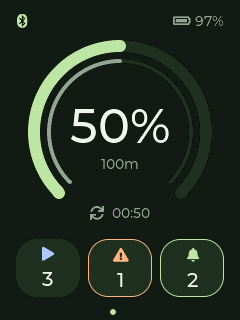

# Codex Passport

[完整中文说明](README.zh_CN.md)


Synthetic quota fixture rendered on the physical device; no account or conversation data.


An independently written Codex notification and usage companion for FoloToy AI Passport.
Computer → encrypted BLE → Passport, or computer → LAN/WireGuard → Android → encrypted BLE → Passport.
The application does not reuse the studied reference application's implementation.
Official FoloToy BSP, Material Components are attributed dependencies.

Meaningful events include completion, failure, interruption, approval and input requests.
Starts, session lifecycle and compaction update silently. Hidden guardian/memory workers
are excluded. Inbox entries are grouped by session and include a bounded title and summary.
SQLite deduplicates and persists events until a device acknowledgement arrives.
Approvals and replies remain in Codex. Global hooks need existing sessions to restart;
incremental logs are a compatibility fallback, not a stable API or Mobile push integration.
Other-host sessions require a collector on that host.

## Run

```sh
uv sync --extra ble
export COMPUTER_LAN_IP="your-computer-private-IP"
uv run codex-passport --state-dir .runtime/live install-hooks
uv run codex-passport --state-dir .runtime/live serve --host "$COMPUTER_LAN_IP" --port 18765
```

Configure Android with the relay address and `.runtime/live/relay-token` in its Connection
page. These are separate from wireless ADB addresses. Keep the existing WireGuard tunnel
enabled outside the LAN. HTTP is restricted to private destinations; do not expose it publicly.
A dedicated token and paired BLE link protect access. Bounded summaries can contain private
conversation context; complete transcripts and raw commands are not forwarded.

`scripts/install_macos_service.py` installs a user LaunchAgent bound only to the configured
LAN address. Use a persistent Python environment for hooks, rather than an ephemeral uvx cache.

## Apps

Android 6+; official Material 3 Expressive 1.14.0 theme, overview/inbox/connection pages,
light/dark palettes, accessible controls and usage indicators. Nearby Devices is required on
Android 12+; older versions need location for BLE scanning. A connectedDevice foreground
service retries delivery. The APK is an internal debug-signed build.

Passport uses a native 240×320 visual dashboard: quota-remaining outer arc, time-remaining inner arc,
remaining quota in the center, plus running/waiting/unread icons. Orange is faster than an even
budget, green balanced and blue slower, with a five-percentage-point tolerance. UP/DOWN switches quota windows;
OK marks received notifications read; hold OK to reconnect without deleting bonds.
The first press while asleep only wakes the screen. Double-click does nothing. Backlight sleeps after 60 seconds without alerts/buttons.
BLE uses longer intervals and slave latency; unchanged snapshots send approximately every
12 seconds. Battery current and endurance have not been measured.

Quota windows use actual `account/rateLimits/read` results and optional `account/usage/read`.
Expired/stale quota is unavailable, never fabricated as full.

## Build

```sh
uv run python -m unittest discover -s tests -v
uv build
uvx --from ./dist/codex_passport_sync-0.1.0-py3-none-any.whl codex-passport --help
```

Python 3.10+, ESP-IDF 5.5.3, Gradle 8.14.4 / AGP 8.10.1. Build Android with `assembleDebug`
and firmware with `idf.py -C firmware build`. The local wheel works with uvx; no PyPI release yet.
Flash **only the app at 0x10000**, preserving bootloader, partition table, NVS, cardid and Recovery.
The graphical app fits the 3 MB factory partition; the 1 MB Recovery warning does not mean it
should overwrite Recovery. The private device backup is excluded from all packages.

See the Chinese guide for exact deployment commands, pinned dependencies, validation and limits.

References: [FoloToy](https://github.com/folotoy/ai-passport),
[studied reference](https://github.com/zt20/codex-usage-ai-passport),
[Codex hooks](https://learn.chatgpt.com/docs/hooks), [app server](https://learn.chatgpt.com/docs/app-server),
[M3 Expressive](https://m3.material.io/blog/building-with-m3-expressive).

## Direct computer BLE

Install the `ble` extra and add `--ble "Passport-XXXXXX"` to `serve` (or to the macOS installer).
Use the device's advertised name or OS Bluetooth address. Pair in the OS dialog with the current
six-digit device code; grant Bluetooth access first, interactively on macOS. Android's Connection
page selects phone forwarding or direct computer BLE. Only one connection owns delivery.
If desktop pairing/connect/ACK fails, ownership returns to the phone and stays there until you
select desktop again. VPN connectivity is not treated as Bluetooth proximity. Both routes share
the durable outbox and device receipts. `ble --device NAME --once` is a foreground diagnostic
against existing collector state; pause the phone first when using that standalone command.

Run `python scripts/fetch_bsp.py` before building firmware. The source checkout excludes private
state, binaries and device backups. See [validation](docs/VALIDATION.md) and [dependencies](THIRD_PARTY.md).

Daily BLE frames carry only quota, counts and receipt IDs; conversation titles, summaries and project names stay on the phone.
