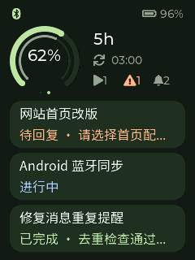

# Codex Passport

把 Codex 会话通知和账户用量同步到 FoloToy AI Passport，搭配 Android 手机使用。

**[第一次使用？从这里一步步安装](docs/GETTING_STARTED.zh_CN.md)** · [Python / uvx 安装](docs/PYTHON.md) · [下载 APK 和固件](https://github.com/JuneLeGency/codex-passport/releases/tag/v0.2.0) · [English](README.md)




设备实机渲染的合成示例，不包含账号用量或真实会话内容。

## 能做什么

- 电脑直接通过加密 BLE 发送到 Passport，或通过局域网/WireGuard 交给 Android 再转发 BLE。
- 本机各 Codex 会话的完成、失败、中断、需批准和等待输入提醒；开始、会话生命周期和压缩等状态静默更新，过滤内部 guardian 与记忆整理任务。
- 消息持久化、去重、设备回执和断线补送；两条 BLE 路径共享队列，一次只由一个发送方连接。
- 将本周期剩余额度与剩余时间对比，直观看到消耗偏快、均衡或偏慢。
- 原生 Passport 小屏图形与实体按键；Android 使用 Material 3 Expressive，提供概览、通知、连接三页。

手机显示最近四个会话的短标题和摘要；标题最多 60 UTF-8 字节、摘要最多 120 字节，不是完整上下文。
Passport 保留原来的大 dashboard，并增加独立的紧凑用量 + 三会话进展页。只显示最近更新的 3 个可见会话，含标题、当前状态和一行短摘要；无需打开详情或滚动列表。
**本版不支持手机恢复会话、回复问题或人工批准操作**；这些仍在 Codex 完成。OK 标记已读不代表批准。

## 新手从哪里开始

[从零入门指南](docs/GETTING_STARTED.zh_CN.md) 按顺序覆盖：

1. 准备设备、安装 uv、下载项目。
2. 备份 Passport，只烧录应用分区。
3. 手机直接下载 APK 安装，无需 Android Studio 或无线 ADB。
4. 查电脑 IP、安装 Hooks、启动中继、填写手机地址与密钥。
5. 用 Passport 当前六位码完成配对，再用真实 Codex 通知验收。
6. 看懂用量图和按键，配置登录自启动、电脑直连与手机转发。
7. 排查常见问题，更新、暂停和卸载。

指南以实测的 **macOS + Android + AI Passport** 为主，不限电脑机型。Linux 需适配系统服务和蓝牙；Windows 主机未完成验收，不能直接照抄本指南的 shell 命令。

## 版本与安装文件

| 文件 | 用途 |
| --- | --- |
| [Python `codex-passport-sync` 0.2.0](https://pypi.org/project/codex-passport-sync/) | 电脑采集器和中继；增加三会话当前进展同步 |
| [Android APK 0.2.0](https://github.com/JuneLeGency/codex-passport/releases/tag/v0.2.0) | 手机伴侣；调试签名，尚未上架应用商店 |
| [Passport 固件 0.2.0](https://github.com/JuneLeGency/codex-passport/releases/tag/v0.2.0) | 设备上的图形仪表；只烧录到官方布局的应用分区 `0x10000` |

从旧版升级时，请同时更新 Python 中继、APK 和 Passport 固件到 0.2.0，才能显示设备端进展列表；保留原状态目录和蓝牙绑定。发布页同时提供 SHA256 校验和第三方许可证。
如果只想先查看 Python 命令，在安装 uv 后运行：

```sh
uvx --from 'codex-passport-sync==0.2.0' codex-passport --help
```

若自定义镜像提示找不到新包，在 `uvx` 后加 `--index https://pypi.org/simple`，优先从官方 PyPI 安装；无须修改全局镜像设置。

日常 Hooks 和自启动需要持久环境，按 [Python 安装指南](docs/PYTHON.md) 或从零指南安装，不要把长期 Hooks 绑定到临时 uvx 缓存。

## 日常使用

Passport 外环是剩余额度，内环是剩余时间。橙色表示消耗领先时间超过 5 个百分点，绿色表示基本同步，蓝色表示较慢；周期最初 1% 暂不判断快慢。
这是当前消耗进度的比较，不是未来用量预测。接口无返回、额度过期或超过 180 秒未更新时显示不可用，不编造满额。

短按上/下切换两页；长按上/下切换用量周期；亮屏时短按 OK 标记已读；长按 OK 重连并保留配对。新提醒会唤醒，但不强制切页。
熄屏后第一次按键只唤醒，不清未读。60 秒无提醒/按键后熄屏，新提醒会亮屏。屏幕不支持触控。

离开电脑时，在手机“连接”页选择“使用手机转发”。电脑连接失败也会回退到手机，回退后不会反复抢连接；回到电脑旁可主动切回直连。
外出需要你自己的 WireGuard 路由能访问电脑中继。电脑保持开机和中继运行，手机与 Passport 保持 BLE 可达。

## 数据与验收边界

Hooks 安装后需要重新打开已有 Codex 会话；增量日志是兼容性补偿，格式不是稳定 API。
本项目没有接入 Codex Mobile 私有推送服务，不保证逐项等价。其他电脑的会话需在对应主机采集。

0.2.0 会通过已配对的加密 BLE 传递最多三个会话的短标题与进展摘要，内容可能涉及隐私。只给自己的手机配置专用密钥。设备内置开源 CJK 字库，支持空格和常用中文；未覆盖的 emoji/罕见字符在设备上省略，不显示方框。完整对话和原始命令不转发，常见凭据模式会脱敏，但不要因此把中继或摘要公开。
HTTP 中继仅供私有网络/VPN 使用，不直接暴露公网。原始 Flash 备份、状态目录和密钥不属于开源发布内容。

电脑直连、手机转发、切换补送和实体按键已通过验收；外网 WireGuard 按本次发布范围未做实测，未测量电流与续航。
详细证据见 [验证记录](docs/VALIDATION.md)。

## 开发与参考

[构建与开发](docs/DEVELOPMENT.md) · [MIT 许可证](LICENSE) · [第三方依赖与许可](THIRD_PARTY.md)

应用代码独立编写。官方 [FoloToy BSP](https://github.com/folotoy/ai-passport) 为单独获取的依赖；[参考应用](https://github.com/zt20/codex-usage-ai-passport) 仅研究，不复用实现。
Android 使用官方 [Material Components](https://github.com/material-components/material-components-android/releases/tag/1.14.0)。本项目是社区作品，不代表 OpenAI 或 FoloToy 官方产品。
